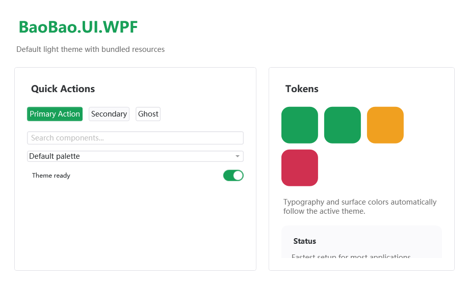
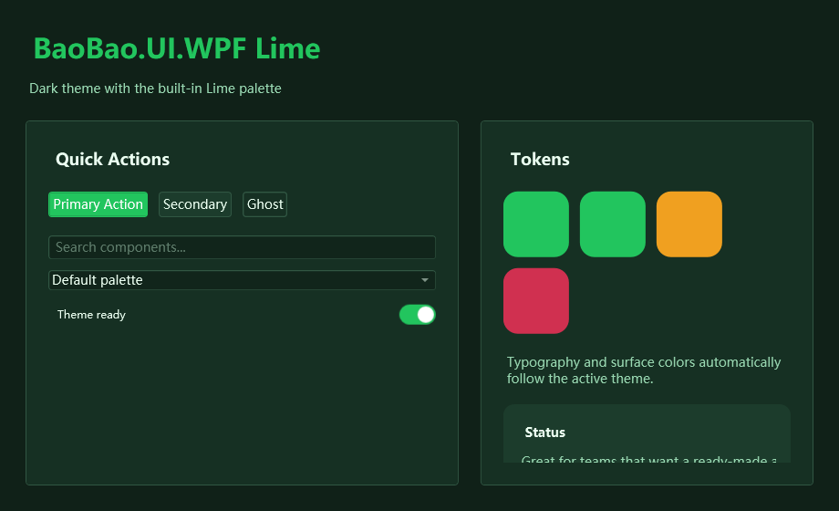
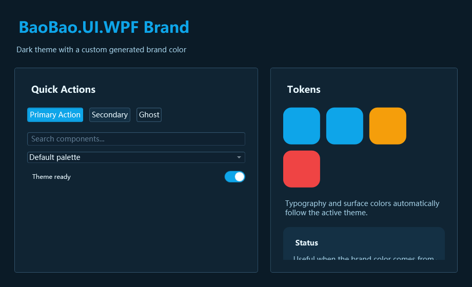

# BaoBao.UI.WPF

`BaoBao.UI.WPF` is a WPF control and theme library with:

- unified application theme resources
- implicit styles for common WPF controls
- custom business-oriented controls
- runtime theme and palette switching

It is designed to be plug-and-play:

- one bundled XAML entry
- one-line startup helper
- built-in theme and palette combinations
- custom brand color support without writing XAML

This repository contains:

- `BaoBao.UI.WPF`: core controls and theme resources
- `BaoBao.UI.WPF.Demo`: demo gallery
- `BaoBao.UI.WPF.Extend`: optional extension controls such as `BaoBaoMarkdown`

## Preview

### Default Light



### Dark Lime



### Dark Custom Brand



## Quick Start

### 1. Reference the project

```xml
<ProjectReference Include="..\BaoBao.UI.WPF\BaoBao.UI.WPF.csproj" />
```

If you also need extension controls:

```xml
<ProjectReference Include="..\BaoBao.UI.WPF.Extend\BaoBao.UI.WPF.Extend.csproj" />
```

### 2. Choose one setup style

#### Option A: one-line XAML setup

```xml
<Application.Resources>
    <ResourceDictionary>
        <ResourceDictionary.MergedDictionaries>
            <ResourceDictionary Source="pack://application:,,,/BaoBao.UI.WPF;component/Themes/BaoBao.xaml" />
        </ResourceDictionary.MergedDictionaries>
    </ResourceDictionary>
</Application.Resources>
```

`Themes/BaoBao.xaml` is the recommended bundled entry point. It loads:

- palette resources
- light theme resources
- size tokens
- base styles
- control styles

#### Option B: one-line code setup

```csharp
using BaoBao.UI.WPF.Helpers;

BaoBaoTheme.UseDefaults();
```

You can also choose theme and palette up front:

```csharp
using BaoBao.UI.WPF.Helpers;

BaoBaoTheme.UseDefaults(ThemeType.Dark, "Lime");
BaoBaoTheme.UseDefaults(ThemeType.Dark, BaoBaoPalette.Lime);
```

You can also start directly from a brand color:

```csharp
using System.Windows.Media;
using BaoBao.UI.WPF.Helpers;

BaoBaoTheme.UseDefaults(ThemeType.Dark, Colors.LimeGreen);
BaoBaoTheme.UseDefaults(ThemeType.Light, "#84cc16", true);
```

### 3. Import namespaces

```xml
xmlns:controls="clr-namespace:BaoBao.UI.WPF.Controls;assembly=BaoBao.UI.WPF"
xmlns:helpers="clr-namespace:BaoBao.UI.WPF.Helpers;assembly=BaoBao.UI.WPF"
```

For extension controls:

```xml
xmlns:extend="clr-namespace:BaoBao.UI.WPF.Extend.Controls;assembly=BaoBao.UI.WPF.Extend"
```

## Themes And Palettes

Runtime switching is supported after either setup style above.

```csharp
using BaoBao.UI.WPF.Helpers;

ThemeManager.SetTheme(ThemeType.Dark);
ThemeManager.SetPalette("Lime");
ThemeManager.SetPalette(BaoBaoPalette.Lime);
```

Conceptually:

- `ThemeType` controls the structural mode, currently `Light` and `Dark`
- `Palette` controls the brand and semantic color tokens that sit on top of the theme

That means they are related, but no longer tightly coupled. You can freely combine:

- `ThemeType.Light + BaoBaoPalette.Default`
- `ThemeType.Dark + BaoBaoPalette.Lime`
- `ThemeType.Light + BaoBaoPalette.VisualStudio`

The recommendation is to think of them as two layers:

- theme = brightness, surfaces, text direction
- palette = accent color and visual personality

Current state is also available in code:

```csharp
var theme = ThemeManager.CurrentTheme;
var mode = ThemeManager.CurrentPaletteMode;
var builtIn = ThemeManager.CurrentBuiltInPalette;
var custom = ThemeManager.CurrentCustomPalette;
```

## Recommended Usage

For most consumers, these are the three recommended integration styles:

### 1. Use the bundled default setup

Best when:

- you want the fastest adoption
- you are building an internal tool
- you do not need a strong brand color yet

Recommended code:

```csharp
BaoBaoTheme.UseDefaults();
```

### 2. Use a built-in palette

Best when:

- you want a ready-made visual style
- your team prefers stable presets
- you want predictable screenshots and reviews

Recommended code:

```csharp
BaoBaoTheme.UseDefaults(ThemeType.Dark, BaoBaoPalette.Lime);
```

### 3. Use a custom palette

Best when:

- you already have a brand color
- different projects need different accents
- you want runtime branding without maintaining extra XAML files

Recommended code:

```csharp
ThemeManager.SetPaletteFromHex("#84cc16");
```

If the custom brand is shared by multiple applications, consider promoting it into a reusable XAML file under `Themes/Palettes`.

## Selection Guide

Use `ThemeType` when you want to change:

- light vs dark mode
- surface brightness
- text contrast direction
- overall structural feel

Use a built-in `BaoBaoPalette` when you want to change:

- accent color
- semantic color mood
- visual personality
- default brand direction for a project

Use `BaoBaoCustomPalette` when you want to change:

- your company brand color
- colors at runtime
- a subset of tokens only
- project-specific styling without adding new XAML files

In short:

- `ThemeType` = structure
- `BaoBaoPalette` = preset brand style
- `BaoBaoCustomPalette` = user-defined brand style

Built-in palettes:

- `Default`
- `Lime`
- `Blue`
- `Red`
- `Purple`
- `Orange`
- `Cyan`
- `Github`
- `VisualStudio`

## Controls

### Window And Feedback

- `BaoBaoWindow`
- `BaoBaoDrawer`
- `BaoBaoPopover`
- `BaoBaoLoading`
- `BaoBaoToast`
- `BaoBaoMessageBox`
- `BaoBaoCodeExample`

### Input Controls

- `BaoBaoToggleSwitch`
- `BaoBaoNumericUpDown`
- `BaoBaoDateTimePicker`
- `BaoBaoColorPicker`
- `BaoBaoTagInput`
- `BaoBaoRangeSlider`
- `BaoBaoRating`

### Display Controls

- `BaoBaoAvatar`
- `BaoBaoBadge`
- `BaoBaoBreadcrumbBar`
- `BaoBaoTimeline`
- `BaoBaoStepBar`
- `BaoBaoStatistic`
- `BaoBaoDivider`
- `BaoBaoDescriptionList`
- `DescriptionItem`
- `BaoBaoEmpty`
- `BaoBaoSkeleton`
- `BaoBaoCircleProgressBar`
- `BaoBaoCarousel`
- `BaoBaoIcon`
- `BaoBaoUniformGrid`

### Styled Native Controls

The library also provides implicit styles for:

- `Window`
- `Button`
- `TextBox`
- `PasswordBox`
- `CheckBox`
- `RadioButton`
- `ProgressBar`
- `Slider`
- `TabControl`
- `ComboBox`
- `ListBox`
- `GroupBox`
- `DataGrid`
- `TreeView`
- `Expander`
- `Menu`
- `ToolTip`
- `Calendar`
- `DatePicker`
- `ScrollViewer`

## Common Examples

### Custom Window

```xml
<controls:BaoBaoWindow
    Title="Demo"
    Width="1000"
    Height="700"
    Style="{StaticResource BaoBaoWindowStyle}">

    <controls:BaoBaoWindow.TitleBarContent>
        <TextBlock Text="Custom Title Content" />
    </controls:BaoBaoWindow.TitleBarContent>

</controls:BaoBaoWindow>
```

### Toggle Switch

```xml
<controls:BaoBaoToggleSwitch Content="Dark Mode" />

<controls:BaoBaoToggleSwitch IsChecked="True">
    <controls:BaoBaoToggleSwitch.OnContent>ON</controls:BaoBaoToggleSwitch.OnContent>
    <controls:BaoBaoToggleSwitch.OffContent>OFF</controls:BaoBaoToggleSwitch.OffContent>
</controls:BaoBaoToggleSwitch>
```

### Theme Switching

```csharp
ThemeManager.SetTheme(ThemeType.Dark);
ThemeManager.SetPalette(BaoBaoPalette.Lime);
```

### Brand Color Switching

```csharp
ThemeManager.SetPaletteFromHex("#84cc16");
```

### Fully Custom Palette

```csharp
BaoBaoTheme.UseDefaults(
    ThemeType.Dark,
    new BaoBaoCustomPalette
    {
        Primary = (Color)ColorConverter.ConvertFromString("#84cc16"),
        PrimaryHover = (Color)ColorConverter.ConvertFromString("#a3e635"),
        PrimaryPressed = (Color)ColorConverter.ConvertFromString("#65a30d"),
        Info = (Color)ColorConverter.ConvertFromString("#84cc16")
    });
```

### Tag Input

```xml
<controls:BaoBaoTagInput
    Width="320"
    Tags="{Binding Tags}" />
```

Recommended binding type:

```csharp
ObservableCollection<string>
```

### Drawer

```xml
<controls:BaoBaoDrawer
    Header="Settings"
    IsOpen="{Binding IsDrawerOpen}"
    Position="Right">
    <TextBlock Text="Drawer Content" />
</controls:BaoBaoDrawer>
```

### Toast

```csharp
BaoBao.UI.WPF.Controls.BaoBaoToast.Success("Saved");
BaoBao.UI.WPF.Controls.BaoBaoToast.Warning("Please check the input");
```

### Description List

```xml
<controls:BaoBaoDescriptionList>
    <controls:DescriptionItem Label="User Name">
        <TextBlock Text="baobao" />
    </controls:DescriptionItem>
    <controls:DescriptionItem Label="Status">
        <TextBlock Text="Active" />
    </controls:DescriptionItem>
</controls:BaoBaoDescriptionList>
```

### Markdown Extension Control

```xml
<extend:BaoBaoMarkdown Text="{Binding MarkdownText}" />
```

## Helpers

### `BaoBaoTheme`

- `UseDefaults()`
- `UseDefaults(ThemeType theme)`
- `UseDefaults(ThemeType theme, string paletteName)`
- `UseDefaults(ThemeType theme, BaoBaoPalette palette)`
- `UseDefaults(ThemeType theme, BaoBaoCustomPalette palette)`
- `UseDefaults(ThemeType theme, Color primaryColor)`
- `UseDefaults(ThemeType theme, string primaryHex, bool treatAsPrimaryColor)`
- `EnsureResourcesLoaded()`

### `ThemeManager`

- `SetTheme(ThemeType.Light | ThemeType.Dark)`
- `SetPalette("Default" | "Lime" | "Blue" | ...)`
- `SetPalette(BaoBaoPalette palette)`
- `SetCustomPalette(BaoBaoCustomPalette palette)`
- `SetPaletteFromPrimaryColor(Color primary)`
- `SetPaletteFromHex(string hex)`

### `BaoBaoPalette`

- `Default`
- `Lime`
- `Blue`
- `Red`
- `Purple`
- `Orange`
- `Cyan`
- `Github`
- `VisualStudio`

### `BaoBaoCustomPalette`

Use this when consumers want their own brand colors without creating a separate XAML palette file.

Minimal example:

```csharp
using System.Windows.Media;
using BaoBao.UI.WPF.Helpers;

BaoBaoTheme.UseDefaults(
    ThemeType.Dark,
    new BaoBaoCustomPalette
    {
        Primary = (Color)ColorConverter.ConvertFromString("#84cc16"),
        PrimaryHover = (Color)ColorConverter.ConvertFromString("#a3e635"),
        PrimaryPressed = (Color)ColorConverter.ConvertFromString("#65a30d"),
        Info = (Color)ColorConverter.ConvertFromString("#84cc16")
    });
```

You can also switch at runtime:

```csharp
ThemeManager.SetCustomPalette(new BaoBaoCustomPalette
{
    Primary = Colors.DeepSkyBlue,
    PrimaryHover = (Color)ColorConverter.ConvertFromString("#38bdf8"),
    PrimaryPressed = (Color)ColorConverter.ConvertFromString("#0284c7")
});
```

Notes:

- only set the tokens you want to override
- unset values automatically fall back to `Themes/Colors.xaml`
- if a team needs a reusable branded theme, creating a dedicated `Themes/Palettes/YourBrand.xaml` is still the best long-term option
- switching `ThemeType` after applying a custom palette keeps the custom palette active

### `BaoBaoPaletteMode`

- `BuiltIn`
- `Custom`

### `BaoBaoPaletteFactory`

Use this when consumers only know their brand primary color and want BaoBao to generate a usable palette.

```csharp
var customPalette = BaoBaoPaletteFactory.FromHex("#84cc16");
BaoBaoTheme.UseDefaults(ThemeType.Dark, customPalette);
```

Or directly:

```csharp
ThemeManager.SetPaletteFromHex("#84cc16");
```

This factory is intended to give a good default result quickly. If your design team has stricter requirements, use `BaoBaoCustomPalette` or a dedicated XAML palette file instead.

## Best Practices

- Prefer `Themes/BaoBao.xaml` or `BaoBaoTheme.UseDefaults()` as the only theme entry point in app startup.
- Prefer `BaoBaoPalette` for product-level defaults and `BaoBaoCustomPalette` for tenant-level or runtime branding.
- Keep one source of truth for theme selection, usually a settings service or startup bootstrapper.
- If a palette will be reused across multiple apps, create a named XAML palette instead of duplicating code-generated colors.
- Use runtime palette switching for branding, not for one-off control-level color tweaks.

## Demo

`BaoBao.UI.WPF.Demo` now includes a simple theme console at the top of the main window:

- switch `Light / Dark`
- choose a built-in palette
- enter a custom brand hex color
- see the current theme state immediately

Useful files:

- demo window: `src/BaoBao.UI.WPF/BaoBao.UI.WPF.Demo/MainWindow.xaml`
- demo logic: `src/BaoBao.UI.WPF/BaoBao.UI.WPF.Demo/MainWindow.xaml.cs`

## FAQ

### Do `Theme` and `Palette` have to match?

No. They are intentionally decoupled now. `Dark + Lime` and `Light + VisualStudio` are both valid.

### What should library consumers use first?

Start with:

```csharp
BaoBaoTheme.UseDefaults();
```

Then add `ThemeManager.SetPalette(...)` only when you need a stronger brand identity.

### When should I create a XAML palette file instead of using `BaoBaoCustomPalette`?

Create a XAML palette when:

- the palette is shared by many projects
- design review requires fixed tokens checked into source control
- you want a named preset such as `YourCompanyBlue`

Use `BaoBaoCustomPalette` when:

- colors are tenant-specific
- colors come from config or a database
- you need a fast runtime override

### `ControlAttach`

Useful attached properties include:

- `Watermark`
- `Icon`
- `CornerRadius`

Example:

```xml
<TextBox helpers:ControlAttach.Watermark="Enter user name">
    <helpers:ControlAttach.Icon>
        <controls:BaoBaoIcon Icon="Account" />
    </helpers:ControlAttach.Icon>
</TextBox>
```

## Suggested Next Improvements

If you want the library to feel even more plug-and-play, the best next steps are:

- add `Variant` and `Size` attached properties for buttons and inputs
- reduce nullable warnings in template-part driven controls
- add page-level templates such as login, settings, form, and dashboard
- add screenshots or GIFs for interactive controls
- add small tests around `ThemeManager`, `BaoBaoTheme`, `TagInput`, and `Pagination`

## References

- Demo entry: `src/BaoBao.UI.WPF/BaoBao.UI.WPF.Demo/MainWindow.xaml`
- Core controls: `src/BaoBao.UI.WPF/BaoBao.UI.WPF/Controls`
- Theme resources: `src/BaoBao.UI.WPF/BaoBao.UI.WPF/Themes`
